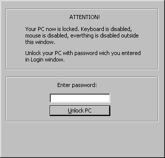



## LOCK PC with password

### Description

This easy code show you how lock your PC in one second with password. All is loceked(mouse,keyboard etc...).

It's easy and for all.
 
### More Info
 

             |
---                |---
**Submitted On**   |2002-02-21 19:13:28
**By**             |[Franjo Boras](https://github.com/Planet-Source-Code/PSCIndex/blob/master/ByAuthor/franjo-boras.md)
**Level**          |Intermediate
**User Rating**    |3.8 (23 globes from 6 users)
**Compatibility**  |VB 4\.0 \(32\-bit\), VB 5\.0, VB 6\.0
**Category**       |[Complete Applications](https://github.com/Planet-Source-Code/PSCIndex/blob/master/ByCategory/complete-applications__1-27.md)
**World**          |[Visual Basic](https://github.com/Planet-Source-Code/PSCIndex/blob/master/ByWorld/visual-basic.md)
**Archive File**   |[LOCK\_PC\_wi566822212002\.zip](https://github.com/Planet-Source-Code/franjo-boras-lock-pc-with-password__1-32000/archive/master.zip)

